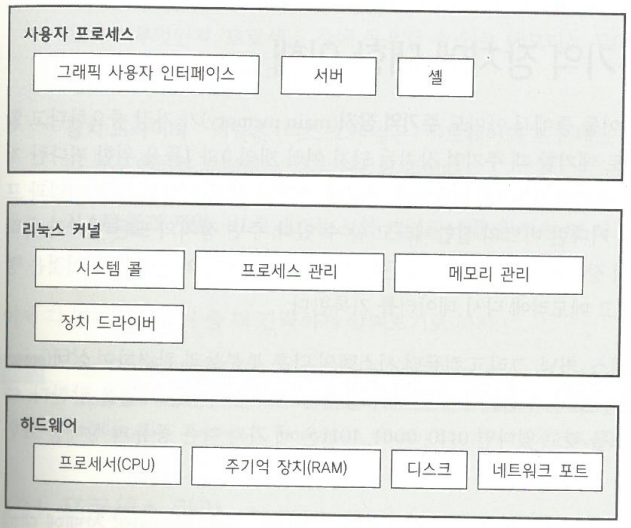
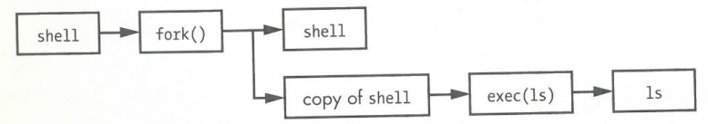
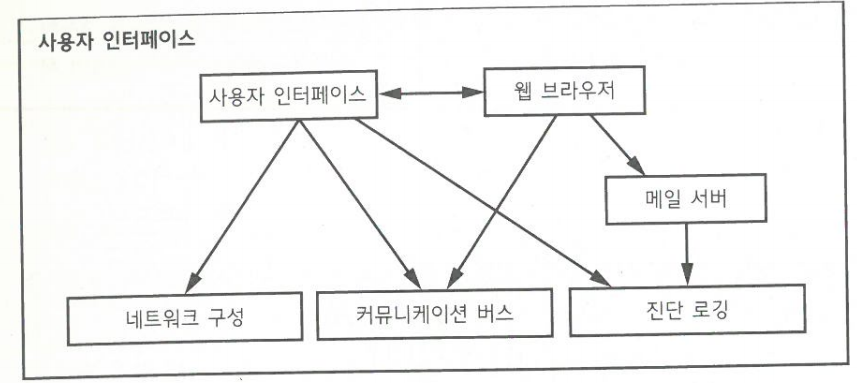
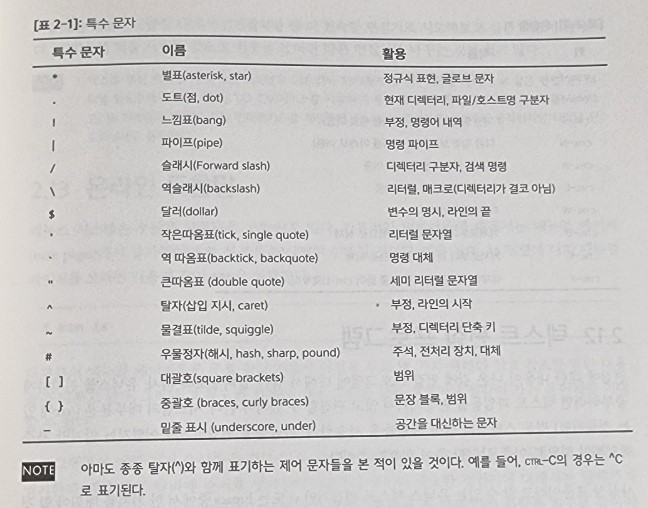
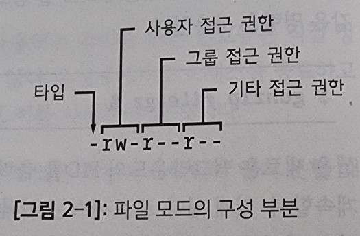
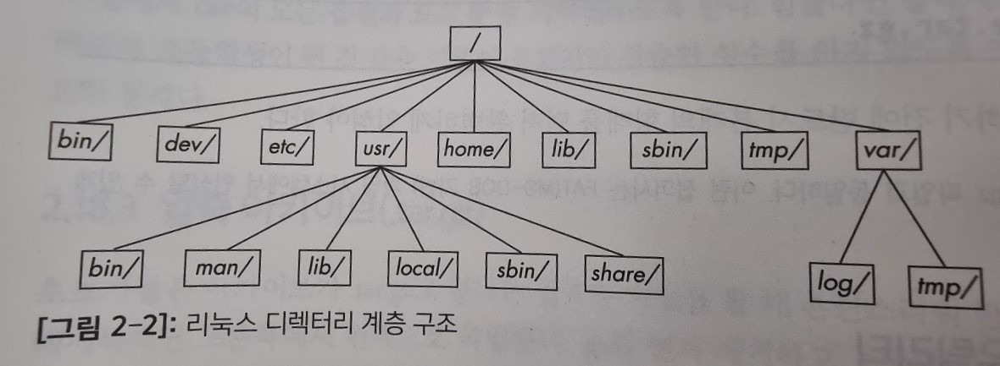

# 리눅스 작동법


---
## 목차 

[1장. 조감도](#1장-조감도)

[2장. 기본 명령어와 디렉터리 계층 구조](#2장-기본-명령어와-디렉터리-계층-구조)

3장. 디바이스

[4장. 디스크와 파일 시스템](#4장-디스크와 파일 시스템)

5장. 리눅스 커널 부팅 방법

6장. 사용자 공간 시동 방법

7장. 시스템 설정: 로깅, 시스템 시간, 일괄 작업과 사용자

8장. 프로세스와 리소스 활용

9장. 네트워크와 그 설정에 대한 이해

10장. 네트워크 응용프로그램과 서비스

11장. 셸 스크립트 소개

12장. 네트워크를 거쳐 파일 옮기기

13장. 사용자 환경

14장. 리눅스 데스크톱에 대한 조망

15장. 개발 툴

16장. C 소스 코드로 소프트웨어 컴파일하는 기본적인 방법

17장. 기초를 바탕으로 길제 구축하기

---
## 1장. 조감도

- 운영체제가 동작하는 방법을 추상(abstraction)으로 이해하자
    - 추상? 대부분의 상세 부분을 무시하는 것

### 1.1 리눅스 시스템의 추상화 레벨과 레이어

- 레이어(layer) or 레벨(level)
    - 해당 구성요소가 사용자와 하드웨어 사이의 어디에 위치하는지에 따라 구성요소를 구분(그룹으로 분류)하는 것

- 리눅스 시스템 세가지 주요 레벨
    

- 커널과 사용자 프로세스 동작 방식 차이점
    - 커널 
        - 커널 모드(kernel mode)에서 동작
        - 프로세서나 주기억 장치에 제한 없이 접근 가능
        - 커널 공간(kernal space)
            - 커널만 접근 가능한 영역
    - 사용자 프로세스
        - 사용자 모드(user mode)에서 동작
        - (아주 적은) 메모리 공간의 일부와 안전한 CPU작업에만 접근할수 있도록 제한됨
        - 사용자 공간
            - 사용자 프로세스가 접근할 수 있는 주기억 공간의 일부
        - 만약 프로세스가 실수하더라도 결과가 제한적이고 커널에서 해결 가능

### 1.2 하드웨어: 주기억 장치에 대한 이해

- 주기억 장치(main memory)
    - 0과 1(비트)들을 위한 커다란 저장 공간(집합체)
    - 실행 중인 커널과 프로세스가 상주하는 공간
    - 주변 장치의 모든 입출력이 비트 묶음의 형태로 주기억 장치로 흘러들어가게 됨

- CPU
    - 메모리상의 운영자
    - 명령들과 메모리의 데이터를 읽고 메모리에 다시 데이터를 기록

- 상태(state)
    - 비트의 특정한 배열
        - 예시) 메모리에 4비트 -> 0110,0001,1011 세가지 다른 종류의 상태를 표현함
    - 상태에 대해 추상적 용어를 사용
        - 비트를 사용하여 상태를 묘사하는 것이 아니라 어떤 것이 무엇을 했는지, 그 순간 어떤 동작을 하고 있는지를 묘사
        - 단 하나의 프로세스가 메모리에서 수백만의 비트로 구성되기 때문에 추상적 용어 사용이 더 쉬움 

### 1.3 커널

- 커널이 실행하는 거의 모든 작업은 주기억 장치를 위주로 진행
- 커널은 메모리를 여러 개의 구획으로 분리하고, 구획에 대한 상태 정보를 항상 보유해야함
- 각 프로세스는 메모리에 각자의 구획을 갖고, 커널은 각 프로세스가 각각의 구획을 유지를 하는지 확인

- 커널의 유지 책임(아래 네가지 일반 시스템 영역내 작업 유지)
    - 프로세스 
        - 커널은 어떤 프로세스가 CPU의 사용을 허용받았는지 알고 있어야 함 
    - 메모리 
        - 커널은 모든 메모리를 지속적으로 파악해야함
            - 현재 특정 프로세스에 할당된 메모리가 무엇인지
            - 프로세스 간 공유할 수 있는 메모리는 무엇인지
            - 할당되지 않은 것은 무엇인지
    - 장치 드라이버
        - 커널은 (디스크와 같은) 하드웨어와 프로세스 사이의 인터페이스로 동작
        - 하드웨어를 운영하는 것은 커널의 일
    - 시스템 콜과 지원
        - 프로세스는 보통 커널과 소통을 하는데 시스템 콜(system call)을 사용

#### 1.3.1 프로세스 관리

- 프로세스의 시작, 멈춤, 재개와 종료에 대한 것
- 문맥 전환(context switch)
    - 하나의 프로세스가 다른 프로세스를 위해 CPU에 대한 제어를 포기하는 행위
    - 유저입장에서는 프로세서들이 동시에 실행하는 것처럼 보이지만, 1개 코어로 실행할 경우 1초보다 짧은 시간 동안 CPU를 사용한 후 멈추고, 다른 프로세스가 CPU를 사용함
    - 커널이 책임짐
- 타임 슬라이스(time slice)
    - 각 시간의 조각
    - 중요한 연산을 하기에 충분한 시간을 프로세스에 부여
    - 조각들이 너무 작기 때문에 동시에 다수의 프로세스를 실행 하는것 처럼 보임(다중 작업 처리-multitask 능력)
- 문맥전환의 흐름
    1. CPU(실질적 하드웨어)는 내부 타이머를 기초로 하여 현재 프로세스를 중단하고 커널 모드로 전환. 그리고 커널에 통제권을 넘김
    2. 커널은 CPU와 메모리의 현재 상태를 기록. (방금 중지된 프로세스를 다시 재개하는데 필수적)
    3. 커널은 이전 타임 슬라이스 동안 발생해야 했던 작업들을 실행(입출력,여러 활동등으로부터 데이터를 수집하는 등의 작업)
    4. 커널은 다른 프로세스가 동작할 수 있도록 준비. 커널이 실행할 준비가 된 프로세스 목록을 분석하고 하나를 선택
    5. 커널은 이 새로운 프로세스를 위한 메모리 준비. 이어서 CPU 준비시킴
    6. 커널이 새로운 프로세스를 위한 타임 슬라이스가 얼마나 걸릴 것인지 CPU에게 알림
    7. 커널이 사용자 모드로 CPU를 전환하고, CPU 통제권을 프로세스에 넘김
- 커널은 문맥전환이 이뤄지는 동안 프로세스의 타임 슬라이스 사이 사이에 실행됨
- 다수의 CPU를 갖춘 시스템의 경우 좀더 복잡(현재 CPU에 대한 통제권을 커널이 포기할 필요가 없기 때문)

#### 1.3.2 메모리 관리

- 커널은 문맥 전환이 이뤄지는 동안 메모리를 관리하는 복잡한 작업 수행
- 수행 조건
    - 커널은 사용자 프로세스가 접근할 수 없는 전용 영역을 메모리 안에 보유하고 있어야 한다
    - 각 사용자 프로세스는 자신만의 메모리 구역이 있어야 한다
    - 하나의 사용자 프로세스는 다른 프로세스의 전용 영역에 접근할수 없다
    - 사용자 프로세스들은 메모리를 공유할 수 없다
    - 사용자 프로세스에서 일부 메모리는 읽기 전용이 될 수 있다.
    - 시스템은 보조로 디스크 공간을 사용함으로써 물리적으로 존재하는 것보다 더 많은 메모리를 사용할 수 있다
- 가상 메모리(virtual memory) 라고 하여 메모리 접근을 계획할수 있게 해주는 메모리 관리 유닛(memory management unit, MMU)을 포함
- 커널은 각각의 프로세스가 머신(machine) 전체를 점유하고 있는 것처럼 동작하도록 해당 프로세스를 설정
    - 프로세스가 메모리의 일정 부분에 접근할 때 MMU는 그 접근을 가로채서 메모리 어드레스 맵(ememory address map, 메모리 주소 지도)을 사용하여 프로세스의 메모리 위치를 머신상의 실질적인 물리적 메모리 위치로 변환시킴
    - 커널은 여전히 이 메모리 어드레스 맵을 초기화시키고 지속적으로 유지하며 변경해야함

#### 1.3.3 장치 드라이버와 관리

- 보통 커널 모드에서만 접근 가능 (부적절한 접근으로 머신에 손상이 올수 있기 때문에)
- 장치 드라이버는 전통적으로 커널 영역(같은 장치라도 동일한 프로그래밍 인터페이스 갖는 경우가 드물기 때문)
- 장치 드라이버들은 SW 개발자들의 작업을 단순화하기 위해 사용자 프로세스에 동일한 인터페이스를 제공하기 위해 노력중

#### 1.3.4 시스템 호출과 지원

- 시스템 콜은 사용자 프로세스 단독으로는 잘할 수 없거나 전혀 할수 없는 특정한 작업을 수행
- 파일 읽고 쓰는 기능은 모두 시스템 콜과 관련

- fork()
    - 프로세스가 fork()를 호출할 때 커널은 프로세스와 거의 일치하는 복사본을 만들어낸다.
- exec()
    - 프로세스가 exec(program)를 호출할 때 커널은 program을 시작하여 현재 프로세스를 대신한다.

- 리눅스 시스템상의 모든 사용자 프로세스는 fork()의 결과로 시작
- 대다수의 경우 기존 프로세스의 복사본을 실행하지 않고 exec()를 실행하여 새로운 프로그램을 시작

- 예시(명령어 ls 실행)
    
    
    1. 터미널 윈도우에 ls를 입력한다면 윈도우 내부에서 실행되고 있는 셸이 fork()를 호출 -> 셸의 복사본 생성
    2. 셸의 새로운 복사본이 exec(ls)를 호출하여 ls 실행 

- 의사 장치(pseudodevices)
    - 커널은 전통적인 시스템 호출이외의 기능을 통해 사용자 프로세스들을 지원, 의사 장치는 그 중 하나
    - 사용자 프로세스의 입장에서는 장치처럼 보여짐
    - 실제로는 순전히 소프트웨어로 구현됨
    - 예시
        - 커널 난수(random number) 생성장치(/dev/random)
    - 기술적으로 의사 장치에 접근하는 사용자 프로세스는 여전히 장치를 여는 데 시스템 콜을 사용해야함. 피할 수 없음

### 1.4 사용자 공간

- 커널이 사용자 프로세스에게 할당하는 주요 메모리
- 프로세스 타입과 상호작용

    - 상위레벨
        - 사용자와 가장 가까운 레벨
        - 사용자들이 직접 제어하는 복잡한 작업 수행
    - 중위레벨
        - 하위 레벨보다 좀 더 큰 요소를 포함
        - 메일, 프린트, 데이터베이스 서비스
    - 하위레벨 :
        - 커널과 가까운 레벨 
        - 단순 작업, 복잡하지 않은 작업 수행 요소들로 구성
        - 네트워크 구성, 커뮤니케이션 버스...
- 일부 사용자 공간 요소들은 분류하기 어려움(작업이 복잡해서)
    - 웹, 데이터베이스 서버

### 1.5 사용자

- 리눅스 커널은 유닉스 사용자에 대한 전통적인 개념을 지원
- 사용자(user)
    - 프로세스들을 실행할 수 있고 파일들을 소유할 수 있는 독립체
    - 사용자 이름(username)과 관련 있음
    - 사용자 ID(userid)
        - 단순한 숫자로 구성된 식별자 
- 접근 권한과 한계를 지원하기 위해 존재
- 모든 사용자 공간 프로세스는 owner 라는 사용자를 갖고 있고, 프로세스들은 owner로써 실행된다
    - 소유 프로세스의 행동을 종료, 수정 가능
    - 단, 다른 사용자의 프로세스 방해는 할 수 없음
    - 파일 소유, 다른 사용자들과 파일들을 공유할것인지 선택가능
- root
    - 다른 사용자의 프로세스를 종료시키고 변경할 수 있음
    - 슈퍼 사용자(superuer) 라고 불림
    - 루트로 운영할 수 있는 사람에 대해 루트 접근 권한을 가지고 있다고 말함
    - 전통적 유닉스 시스템상에서 관리자(administrator) 라고 함
- 그룹(groups)
    - 다수의 사용자들로 구성된 세트
    - 목적
        - 사용자가 그룹 내의 다른 사용자들과 파일 접근을 공유할수 있도록 하려는 것

----
## 2장. 기본 명령어와 디렉터리 계층 구조

- 리눅스는 유닉스에서 파생 된 변종. 
    - 이번 장에서 배운 것들은 다른 변종 유닉스 시스템에서도 사용이 가능 하므로 유닉스 명령어라고 정의
---
### 2.1 본 셸(Bourne Shell): /bin/sh
---
- 셸은 사용자가 입력하는 명령어들을 실행하는 프로그램으로 가장 중요한 부분 중 하나이다.
- 셸 스크립트(shell scripts)는 일련의 셸 명령어들을 포함하고 있는 텍스트 파일을 일컫는다.
- 여러가지 다른 유닉스 셸들이 존재하지만 모두 본 셸(/bin/sh)에서 여러 가지 기능들이 파생됨.
- 본 셸은 벨 연구소에서 초기 유닉스 버전을 위해 개발 됨.
- 리눅스의 경우 bash(bourne again shell)이라고 불리우는 보강된 본 셸 버전을 default 사용한다.
    - /bash/sh 보통 리눅스 시스템상의 bash로 연결되는 링크.
---
### 2.2 셸 활용
---
#### 2.2.1 셸 윈도우

- 프롬프트는 운영 체제 마다 다름
    -  우분투 name@host:path$ 페도라 계열 \[name@host path\]$
- 슈퍼 사용자(root)로 로그인 시 #으로 시작되며, 일반 사용자는 $로 표시 됨. 

#### 2.2.2 cat

- cat은 concatenation(연속적인)의 약자로 cat file1 file2를 사용하게 되면 단순히 file1, file2의 내용을 연이어 출력함.

#### 2.2.3 표준 입력과 표준 출력

- 유닉스 프로세스는 데이터를 읽고 쓰는 데 입출력 스트림(I/O stream)을 사용한다. 
    - 스트림은 매우 융통성이 있어서 입력 스트림의 출처가 파일, 장치 또는 터미널이 될 수 있으며, 다른 프로세스의 출력 스트림이 될 수 있다. ex) ps -ef | grep 
- cat
    - cat의 경우 아무 명령어를 입력 하지 않으면 표준 입력 스트림으로부터 데이터를 읽게 되는데, 표준 입력은 터미널에 연결된다.
    - cat 명령은 출력을 항상 표준 출력(터미널)로 내보낸다.
    - 표준 입력과 출력은 stdin, stdout의 축약어로 부르기도 한다.
---
### 2.3 기본 명령어
---
#### 2.3.1 ls

- ls 명령은 디렉터리의 콘텐츠를 열거하는 명령이다. (default는 현재 디렉터리)
    - > $ ls -l
        - 상세한 목록을 보여준다.
    - > $ ls -F
        - 파일 타입정보를 보여주게 된다.

#### 2.3.2 cp

- cp는 파일을 복사하는 명령어이다.
    - > $ cp file1 file2
        - file1을 file2로 복사한다.
    - > $ cp file1 file2 ... fileN dir 
        - dir이라는 디렉터리에 file들을 복사한다.

#### 2.3.3 mv

- mv(move) 명령은 cp와 비슷하며 파일을 이동시키는(파일명을 바꾸는) 명령어이다.
    - > $ mv file1 file2
        - file1의 이름을 file2의 이름으로 바꾼다.
    - > $ mv file1 ... fileN dir
        - dir이라는 디렉터리에 file들을 옮긴다.

#### 2.3.4 touch

- touch 명령은 파일을 생성하는 명령이다. 
- > $ touch file
    - 파일이 이미 존재
        - ls -l 명령으로 출력되는 파일의 수정 시간 기록을 업데이트
    - 파일이 존재하지 않음
        - 빈 파일을 생성한다.
> $ ls -l file <br> -rw-r--r-- 1 juser users <u>0 May 21 18:32</u> file

#### 2.3.5 rm

- rm은 파일을 삭제하는 데 활용 된다. 파일을 삭제한 후에는 되살릴 수 없다.
    - > $ rm file

#### 2.3.6 echo

- echo 명령은 표준 출력으로 인수들을 출력한다.
    - > $ echo Hello again. <br> Hello again.
---
### 2.4 디렉터리 탐색
---
- 유닉스는 /에서 시작되는 디렉터리 계층 구조를 갖고 있다 이것을 **루트 디렉터리** 라고 부른다.

    - 디렉터리의 구분자는 역슬래시(\\)가 아니고 슬래시(/)임에 주의.

- /로 경로가 시작 된다면 전체, 절대 경로이다.

- ..은 그 디렉터리의 부모의 디렉터리를 의미한다.
    - 현재 위치가 **/usr/lib**라면 ../는 /usr를 의미하며 ../bin은 /usr/bin을 의미한다.

- . (점 하나)은 현재 디렉터리를 의미한다. 
    - 경로가 /로 시작되지 않는다면 대부분의 명령어들은 현재 디렉터리를 디폴트로 하기 때문에 자주 사용하지 않는다.

- /로 시작되지 않는 경로를 상대 경로라고 한다.

#### 2.4.1 cd

- 현재 작업 중인 디렉터리를 변경하는 명령어이다.
- cd만 입력 시 홈 디렉터리로 돌아간다.
    - > $ cd dir

#### 2.4.2 mkdir

- mkdir 명령은 새로운 디렉터리를 생성한다.
    - > $ mkdir dir

#### 2.4.3 rmdir

- rmdir 명령은 디렉터리 dir을 삭제한다.
- dir이 비어있지 않다면 명령이 실패하며 이 경우 rm -rf dir을 사용하면 디렉터리와 그 내용을 삭제 할 수 있다.
    - > $ rmdir dir
    - > $ rm -rf dir

#### 2.4.4 셸 글로빙(와일드 카드)

- 셸은 파일과 디렉터리 이름에 간단한 패턴들을 대응 시킬 수 있는데. 이런 과정을 **글로빙(globbing)** 이라고 한다.
- 셸은 글로브를 포함하는 인수들을 파일 이름에 대응시켜서 그 인수들을 파일 이름들로 대체한 다음, 수정된 명령줄을 실행한다. 대체하는 것을 **확장(expansion)** 이라고 부른다.
- 글로브와 일치하는 파일이 없다면 명령은 *처럼 문자 그대로의 부호로 인식하고 실행한다.
- ?(물음표)는 한 가지 임의의 문자를 대응한다. ex) b?at -> boat, brat와 일치
- ''로 감싸면 글로빙이 아닌 문자 그대로를 인식한다 ex) echo '*'
---
### 2.5 중급 명령
---
#### 2.5.1 grep

- grep 명령은 표현과 일치하는 파일이나 입력 스트림의 라인들을 출력한다.
    - > $ grep root /etc/*
        - root 라는 단어를 포함하고 있는 /etc안의 모든 파일들을 확인한다
        - 자주 쓰이는 옵션에는 -i(대/소문자를구별하지 않는 경우), -v(검색 결과를 뒤바꾸는, 즉 일치하지 않는 모든라인을 출력하는 경우)
    - egrep의 경우 grep -E와 같다
        - 더 많은 확장 정규 표현식을 사용하기 위한 명령어이다.
    - .*는 어떤 문자와도 일치할 수 있다. (와일드카드와 같다)
    - .은 한 가지 임의 문자와 일치한다.

#### 2.5.2 less

- less 명령은 파일이 아주 크거나 명령에 대한 출력 내용이 너무 길어 화면 상단으로 스크롤되어 넘어가는 경우에 아주 편리하게 활용할 수 있다.
- less 내부에서 텍스트를 검색할 수도 있다. (정방향 - /word 역방향 - ?word )
- 리눅스에서는 프로그램의 표준 출력을 다른 프로그램의 표준 입력으로 보낼수 있는데 다른 프로그램의 표준 출력을 less로 보내 출력 내용을 보면 매우 유용하다.
- 다음 예제는 grep 명령의 출력 결과를 less로 보내는 명령이다.
    - > $ grep ie /usr/share/dict/words | less

#### 2.5.3 pwd

- pwd(print working directory) 프로그램은 현재 작업 중인 디렉터리의 이름을 출력한다.
- 심볼릭 링크는 때로 현재 작업 중인 디렉터리의 전체 경로를 모호하게 만들 수 있는데. 이런 혼란을 제거하기 위해 pwd -P(physical)를 사용 할 수 있다. 실제 경로가 출력된다.

#### 2.5.4 diff

- 두 개의 텍스트 파일들 간의 차이점을 알고 싶다면 diff를 사용할 수 있다.
```
$ diff file1 file2
3c3
< walnuts
---
> grapes
```

#### 2.5.5 file

- 리눅스 명령어 file은 파일의 종류 확인 및 파일 속성 값을 확인할때 사용하는 명령어다. 주로 acsii나 text, date와 같은 파일 속성을 출력하는데, /usr/share/magic이나 /usr/lib/magic에 저장한 파일 정보를 참고하여 파일 속성을 출력한다.
- > $ file filename

#### 2.5.6 find와 locate

- find 명령은 어떤 특정 파일이 디렉터리 트리 중 어딘가에 있는지를 알아 낼 때 유용하게 사용한다.
- locate 명령은  검색DB(파일 목록 데이터베이스)를 미리 생성하기 때문에 속도가 빠르다. 미리 만들어 놓은 DB파일에서 파일을 검색하기 때문에 최근에 삭제된 파일도 검색이 되는 문제가 발생하게 되므로 locate 명령어를 사용하기 전에 색인을 업데이트 해야함(updatedb)

#### 2.5.7 head와 tail

- head는 파일의 처음 10줄을 보여주며 tail은 마지막 10줄을 보여준다.
- -n 옵션으로 화면에서 보기 원하는 라인의 개수를 변경 할 수 있다.

#### 2.5.8 sort

- sort 명령은 텍스트 파일의 라인들을 글자와 숫자의 순서에 따라 빠르게 정렬시킨다.
- -r 옵션은 순서를 반대로 정렬하며 숫자에 따라 순서대로 정리하고 싶다면 -n 옵션을 사용한다.
- > $ cat /etc/passwd | sort -r
---
### 2.6 비밀번호와 셸 변경하기
---
- passwd 명령을 사용하여 비밀번호를 변경할 수 있다. 이전 비밀번호를 먼저 요구한 다음, 이어서 새로운 비밀번호를 두 번 입력한다.
---
### 2.7 Dot Files
---
- .bashrc .login등의 파일
- 도트 파일은 일반 ls명령어에 옵션 -a를 주어야 볼수 있다.
- 셸 글로브들은 분명하게 .*와 같은 패턴을 사용하지 않는 한 도트 파일들과 일치하지 않는다.
---
### 2.8 환경 변수와 셸변수
---
- 셸은 셸 변수 라고 불리는 텍스트 문자열의 값을 포함하는 임시 변수들을 저장할수 있다.
- >$ STUFF=blah
- 조회는 $STUFF로 할수 있다
- >$ echo $STUFF

- 환경 변수(environment variables)도 셸 변수와 마찬가지지만 셸에 한정 되지 않으며 운영체제가 셸의 모든 환경변수들을 셸이 실행하는 프로그램으로 전달한다.
- 셸의 export 명령으로 환경 변수를 할당한다.
- >$ export STUFF
---
### 2.9 명령어 path
---
- 명령어 path는 명령어의 위치를 찾으려고 할 때 셸이 검색하는 시스템 디렉터리 목록을 말한다.
- > echo $PATH
    - 경로 구성 요소들은 콜론(:)으로 분리되어 나타난다.
    - 만약 동일한 이름을 가진 프로그램들이 이 경로의 여러 디렉터리 안에서 나타난다면 셸은 맨 처음 일치하는 프로그램을 실행한다.
- PATH 환경변수 추가
    - > PATH=dir:$PATH
---
### 2.10 특수 문자
---



---
### 2.11 명령줄 편집
---


---
### 2.12 텍스트 편집 프로그램
---
- vi 또는 emacs이 사실상의 표준이라고 할 수 있다.
---
### 2.13 온라인 도움말
---
- man 명령어를 사용한다. 
- > $ man ls
- 키워드로 매뉴얼 페이지를 검색하려면 -k 옵션을 사용한다
- > $ man -k sort
- GNU 프로젝트는 매뉴얼 페이지를 더 이상 유지하지 않고 info(또는 textinfo)라고 불리는 다른 포맷으로 전환하기로 결정했다. 
---
### 2.14 셸 입력과 출력
---
- 표준 입력과 출력을 리다이렉트(redirect) 하는 방법
- command의 출력을 터미널 대신 파일로 보내려면 > 리다이렉션 문자를 사용
- > $ command > file
    - 셸은 만약 파일이 이미 존재하고 있지 않다면 파일을 생성한다. 파일이 이미 존재하면 셸은 기존의 파일을 지운다.
    - 지우지 않고 파일에 출력을 덧붙이려면 ```>>```를 사용한다

#### 2.14.1 표준 오류

- 표준 오류를 리다이렉트 하려면 ```2>``` 문법을 사용한다.
- > $ ls /ffffffff > f 2> e
    - 숫자 2는 셸이 수정하는 스트림ID를 의미한다.
    - 스트림 ID 1 : 표준 출력
    - 스트림 ID 2 : 표준 오류
- ```\>&``` 표기를 사용하여 표준 오류를 표준 출력과 동일한 장소로 보낼 수도 있다.
    - > $ ls /ffffffff > f 2>&1

#### 2.14.2 표준 입력 리다이렉션

- 파일을 프로그램의 표준 입력으로 보내려면 < 연산자를 사용한다.
- > $ head < /proc/cpuinfo
    - 대부분의 유닉스 명령어들은 파일 이름을 인수로 수용해서 흔하지 않다.
---
### 2.15 오류 메시지 이해
---
#### 2.15.1 유닉스 오류 메시지 분석
```
 $ ls /dsafsda
 ls: cannot access /dsafsda: No such file or directory
```
- 메시지에는 세가지 요소들이 있다.
    - 프로그램 이름은 ls다.
    - 파일 이름, /dsafsda는 좀더 구체적인 정보다. 이 경로에 문제가 있다.
    - No such file or directory라는 오류메시지는 파일 이름에 문제가 있음을 나타낸다.


#### 2.15.2 일반 오류
- 유닉스에서 가장 흔히 나타나는 오류 메시지들이다.
    - 파일 또는 디렉터리가 존재하지 않는다 (No such file or directory)
    - 파일이 존재한다 (File exists)
    - 디렉터리가 아니다 / 디렉터리다(Not a driectory, Is a directory)
        - 파일을 디렉터리 처럼, 반대로 디렉터리를 파일처럼 사용하려고 할 때
    - 장치에 남은 공간이 없다 (No space left on device)
        - 디스크 공간이 꽉 찬 상태라는 것이다.
    - 접근 권한 거부 (Permission denied)
        - 접근이 허용되지 않은 어떤 파일이나 디렉터리를 읽거나 쓰려는 시도를 할 때
    - 작업이 허용되지 않는다 (operation not permitted)
        - 소유하지 않은 프로세르를 죽이려고 할 때 발생한다.
    - 세그먼테이션 결함, 버스 에러 (Segmentation fault, Bus error)
        - 프로그램이 접속이 허용되지 않은 메모리의 일부에 접근하려고 시도할때, 운영체제에 의해 발생
---
### 2.16 프로세스의 목록화 및 조작
---
- 프로세스는 실행 중인 프로그램 이며 숫자로 표현되는 프로세스 ID(PID)를 갖게 된다.
- 실행되고 있는 프로세스들을 빠르게 열거하려면 명령줄에서 ps를 실행하면 된다.

```
$ ps
    PID  TTY  STAT TIME COMMAND
    520   p0  S    0:00 -bash
    545   ?   S    3:59 /usr/X11R6/bin/ctwm -W
    548   ?   S    0:10 xclock -geometry -0-0
    2159  pd  SW   0:00 /usr/bin/vi  lib/addresses
    31956 p3  R    0:00 ps
```

- 다음은 각 필드에 대한 설명이다:
    - ```PID``` 프로세스 ID.
    - ```TTY``` 프로세스가 동작하고 있는 터미널 장치.
    - ```STAT``` 프로세스의 상태
    - ```TIME``` 프로세스가 지금까지 사용했던 CPU 시간을 분과 초로 나타낸다. (해당 프로세스가 프로세서에서 명령들을 실행하는 데 사용한 전체 시간의 양)
    - ```COMMAND``` 명령어이다. (프로세스가 이 필드를 본래 값과 다르게 변경할 수 있다)

#### 2.16.1 명령옵션(BSD 스타일)
- ```ps``` 명령은 유닉스, BSD, GNU 형식이 있다.
- ```ps x``` 동작하고 있는 모든 프로세스들을 보여준다.
- ```ps ax``` 소유하고 있는 프로세스들뿐만 아니라 시스템상의 모든 프로세스들을 보여준다.
- ```ps u``` 프로세스에 대한 좀 더 상세한 정보를 포함시킨다.
- ```ps w``` 한 줄로 맞추는 것이 아니라 전체 명령을 보여준다.

- 특정 프로세스를 확인하려면 ```ps 옵션 PID``` 로 확인한다.

#### 2.16.2 프로세스 죽이기

- > $ kill pid
    - 프로세스를 종료시킨다.
- > $ kill -STOP pid
    - 프로세스를 정지시킨다.
- > $ kill -CONT pid
    - 프로세스를 다시 시작한다.
- kill은 운영체제가 프로세스에게 정리할 수 있는 기회를 주지 않고 강제적으로 메모리로부터 제거한다.

#### 2.16.3 작업 제어
- 셸은 작업 제어(job control)를 지원한다
- 다양한 키스트로크와 명령들을 사용하여 TSTP와 CONT 신호를 프로그램으로 보내는 방식이다.
- 현재 작업을 놔둔 채로 다른 작업을 하려면 CTRL-Z를 사용한다.
- fg를 입력해 foreground로 이동하거나 bg를 입력해 background에서 프로그램을 구동한다.

#### 2.16.4 백그라운드 프로세스
- 프로그램이 실행을 마칠 때까지 셀 프롬프트로 다시 되돌아 오지 않으므로 셸로부터 프로세스를 분리하여 & 기호와 함께 "백그라운드"로 가져갈 수 있다.
- > $ gunzip file.gz &
    - 압축을 푸는 동안 다른 작업을 할 수 있다.
    - 새로운 백그라운드의 PID를 출력하는 것으로 응답된다.
    - 로그아웃을 한 후에도 실랳을 계속하게 될 것이다.
- 백그라운드에 있을 때 표준 입력으로부터 무엇인가를 읽으려고 시도한다면 프로그램은 정지하거나 종료될 것이다.
- 프로그램이 표준 출력또는 표준 오류로 무엇인가 출력한다면 다른 작업을 하고 있을때 예기치 않은 출력을 보게 될 수 있다.

---
### 2.17 파일 모드와 접근 권한
---

- 모든 유닉스 파일은 접근 권한을 갖고 있는데. 이 권한이 파일을 읽거나 쓰고 실행할 수 있는지를 결정하게 된다.
- ls -l을 실행시키면 접근 권한에 관한 정보가 나올 것이다.
```
-rw-r--r-- 1 juser somegroup 7041 Mar 26 19:34 endnotes.html
```


- 첫번째 문자는 파일 타입(file type)이다.
    - 대시(-)는 일반 파일(regular file)을 나타낸다.
    - d는 디렉터리를 의미한다.
- 나머지 부분은 접근 권한에 관한 내용이다
    - 사용자(user), 그룹(group), 기타(other)순서로 나뉜다.
        - ```r``` 은 파일을 읽을수 있다는 의미이다.
        - ```w``` 는 파일을 쓸 수 있다는 의미다.
        - ```x``` 는 파일이 실행이 가능하다는 의미다.
        - ```-``` 는 아무 의미도 없다.
- 어떤 실행 파일들은 x 대신 사용자 접근 권한 목록에 s로 되어 있는데, 이것은 실행 파일이 setuid라는 것을 나타낸다.
- setuid는 프로그램을 실행할 때 파일 소유자가 우리가 아니라 사용자인 것처럼 실행을 한다는 의미이다.
- 많은 프로그램들이 루트로써 실행하는 데 이 setuid 비트를 사용한다.

#### 2.17.1 접근 권한 수정

- 접근 권한을 변경하려면 chmod 명령을 사용한다.
```
$ chmod g+r file
$ chmod o+r file
```
- 그룹(g)과 광범위(other의 o) 읽기 접근 권한을 파일에 더한다.
- 한번에 모두 실행 할 수도 있다.
```
$ chmod go+r file
```

- 숫자로 접근 권한을 변경할 수 있다.
```
$ chmod 644 file
```
- 이것을 절대(absolute) 변경이라고 하는데. 모든 접근 권한 비트가 한 번에 설정 되기 때문이다.
- 1(r),2(w),4(x)
- 디렉터리
    - r : 디렉터리 내의 파일의 목록을 볼 수 있다.
    - w : 디렉터리 내의 파일을 삭제, 수정, 변경 가능하다.
    - x : 디렉터리 안으로 접근할 수 있다.
- umask
    - umask 셸 명령을 통해 디폴트 접근 권한을 명시할 수 있다.
    - 어떤 새로운 파일이든지 사전 정의한 접근 권한 세트를 그 파일에 적용하게 한다.
    - umask 값과 새 폴더 퍼미션 값을 더하면 777이 된다. (예: 022 + 755 = 777)
    - 파일의 경우 실행권한은 모두 빠진다.
    - umask 000
        - 새 폴더: 777
        - 새 파일: 666

#### 2.17.2 심볼릭 링크

- 심볼릭 링크(symbolic link)는 다른 파일이나 디렉터리를 가리키는 파일이다.
```
1rwxrwxrwx 1 ruser users 11 Feb 27 13:52 somedir -> /home/origdir
```
- 만약 이 디렉터리에서 somedir에 접근하려고 한다면 시스템은 /home/origdir을 대신 접근하게 할 것이다.

- target으로 부터 linkname이라는 심볼릭 링크를 생성하려면 ln -s를 사용한다.
```
$ ln -s target linkname
```
- 인수 linkname은 심볼릭 링크의 이름이다. 인수 target은 링크가 가리키는 파일이나 디렉터리의 경로다. -s 플래그는 심볼릭 링크를 나타낸다.
---
### 2.18 파일 보관과 압축
---
#### 2.18.1 gzip

- gzip 프로그램(GNU Zip)은 현재 표준 유닉스 압축 프로그램들 중의 하나다.
- gunzip으로 압축을 해제 할 수 있다.
```
gunzip file.gz
```
- 다시 압축하려면 gzip file을 사용한다.

#### 2.18.2 tar

- 다른 운영체제의 zip 프로그램들과 달리 gzip은 파일들의 아카이브를 생성하지 않는다.
- 즉 이 프로그램은 다수의 파일과 디렉터리를 하나의 파일로 보관하지 않는다.
- 아카이브를 생성하려면 대신 tar를 사용한다.
```
$ tar cvf archive.tar file1 file2 ...
```
- c플래그는 생성 모드(create mode)를 활성화 시킨다.
- v 플래그는 상세한 메시지를 출력하도록 활성화한다. 즉 tar로 하여금 아카이브 안의 파일들과 디렉터리들의 이름을 출력하게 한다.
    - tar 가 진행하고 있는 상황을 출력하는 것을 바라지 않는다면 v 플래그를 생략하면 된다.
- f 플래그는 파일 옵션을 나타낸다. 명령줄에서 f 플래그에 이어 등장하는 인수는 tar가 생성해야 하는 아카이브 파일일 것이다.
    - 이 옵션은 항상 그다음에 파일 이름이 와야한다.
- tar 파일 풀기
    - tar 를 사용하여 .tar 파일을 풀려면 x 플래그를 사용한다.
```
$ tar xvf archive.tar
```
- 이 명령에서 x 플래그는 tar를 추출(unpack, extract) 모드가 되도록 한다.

- Table-of-Contents 모드
    - x플래그 사용 전 t플래그를 사용하면 table-of-contents모드로 .tar파일의 내용을 확인해볼 수 있다.
    - 기본적인 아카이브의 무결성을 확인하고 내부의 모든 파일들의 이름을 출력한다.
    - p 옵션은 umask를 무시하고 아카이브에 명시된 정확한 접근 권한을 얻도록 할수 있다.

#### 2.18.3 압축 아카이브(.tar.gz)

- .tar.gz의 경우 gunzip 해제후 tar 해제를 하도록 한다.
```
$ gunzip file.tar.gz
$ tar xvf file.tar
```

#### 2.18.4 zcat
- 아카이브와 압축 기능을 파이프로 결합 할 수 있다.
```
$ zcat file.tar.gz | tar xvf -
```
- zcat 명령은 gunzip -dc와 같은 명령이다. -d 옵션은 압축을 해제하고, -c 옵션은 그 결과를 표준 출력(여기서는 tar 명령)으로 전송한다.
- zcat는 아주 흔하게 사용되기 때문에 리눅스 tar 버전의 경우 단축키가 있다.
```
$ tar zxvf file.tar.gz
$ tar zcvf file.tar.gz
```
---
### 2.19 리눅스 디렉터리 계층 구조에 대한 필수 사항들
---


- ```/bin``` ls와 cp같은 기본적인 유닉스 명령의 대부분을 포함하고 있는 ready-to-run 프로그램을 포함
- ```/dev``` 장치 파일들을 포함한다.
- ```/etc``` 핵심 시스템 설정 디렉터리(core system configuration directory)로써 사용자 비밀번호, 부트, 장치, 네트워킹과 그 외 설정 파일들을 포함한다.
- ```/home``` 일반 사용자들을 위한 개인 디렉터리들을 포함한다.
- ```/lib``` library를 축약한 것이다. 라이브러리에는 정적 라이브러리와 공유 라이브러리가 있다.
- ```/proc``` 일부 커널 매개변수들과 현재 가동 되는 프로세스들에 대한 정보, 통계를 포함하고 있다.
- ```/sys``` 장치와 시스템 인터페이스를 제공한다는 점에서 /proc와 유사하다.
- ```/sbin``` 시스템 실행 파일들을 위한 장소. 일반 유저들은 여기에 요소들을 갖고있지 않다. 루트로 실행
- ```/tmp``` 크게 신경 쓸 필요가 없는 작은 파일이나 임시 파일들을 위한 저장 공간. 어떤 사용자나 사용
- ```/usr``` 이름과 달리 사용자 파일은 전혀 포함되어 있지 않다. 내부는 루트밑의 파일명들과 비슷하다
- ```/var``` 변수 서브디렉터리로써 프로그램들은 이곳에 런타임(runtime)정보를 기록한다. 시스템 로깅, 사용자 트래킹, 캐시 그리고 기타 시스템 파일이 생성하고 관리하는 파일들이 여기에 들어 있다.

#### 2.19.1 기타 루트 하위 디렉터리

- ```/boot``` 커널 부트 로더 파일들을 포함한다. 리눅스의 스타트업 절차의 맨 첫번째 단계와 관련있다.
- ```/media``` 제거가 가능한 미디어를 위한 기본 마운트 지점(attachment point)이다.
- ```/opt``` 추가적인 제 3자 소프트웨어를 포함한다. 많은 시스템들이 /opt를 사용하지 않는다.

#### 2.19.2 /usr 디렉터리

- ```/include``` C컴파일러가 사용하는 헤더 파일들을 보관한다.
- ```/info``` GNU 정보 매뉴얼을 포함한다.
- ```/local``` 관리자가 자신의 소프트웨어를 설치할 수 있는 장소.
- ```/man``` 매뉴얼 페이지들을 포함한다.
- ```/share``` 기능의 손실 없이 다른 종류의 유닉스 머신들과 작업해야 할 파일들을 포함한다.(자주 사용되지 않음)

#### 2.19.3 커널 위치
- 리눅스 시스템에서 커널은 일반적으로 ```/vmlinuz``` 또는 ```/boot/vmlinuz```에 있다. 부트 로더가 이 파일을 메모리로 로딩하고 시스템이 부팅할 때 가동을 시킨다.
- 로딩이 가능한 커널 모듈(loadable kernel modules)는 ```/lib/modules``` 아래에 위치한다.
---
### 2.20 슈퍼 사용자의 명령 실행
---
#### 2.20.1 sudo
- 루트처럼 명령을 실행할 수 있도록 허용한다.
- vipw를 사용하여 /etc/passwd 파일을 편집해 sudo를 사용 할 수 있다. (7장)
```
$ sudo vipw
```
#### 2.20.2 /etc/sudoers
- 시스템은 아무 사용자에게 슈퍼 사용자처럼 명령을 실행하도록 허용하지 않는다. /etc/sudoers에서 권한이 있는 사용자를 설정해야 한다.
```
User_Alias ADMINS = user1, user2

ADMINS ALL = NOPASSWD: ALL

root ALL=(ALL) ALL
```
- user1과 user2에게 비밀번호 입력 없이 루트로서 어떤 명령이든 실행할 수 있는 권한을 부여하고 있다.
- 첫 번째 라인은 ADMINS 사용자 별칭을 두 명의 사용자들로 규정한다.
- 두 번째 라인은 권한을 부여하고 있다. ALL = NOPASSWD: ALL 부분은 ADMINS 별칭의 사용자들이 루트로써 명령을 실행하는 sudo를 사용할 수 있다는 의미이다.
- 두 번째 라인의 첫번째 ALL은 "어떤 호스트이든지" 두 번째 ALL은 "어떤 명령이든지"를 의미한다.
- root ALL = (ALL) ALL은 슈퍼 사용자가 모든 호스트상에서 어떤 명령이든지 실행하는 sudo를 사용할 수도 있다는 의미이다.
- (ALL)은 슈퍼 사용자가 다른 기타 사용자처럼 명령을 실행할 수도 있다는 의미이다.

# 4장. 디스크와 파일 시스템

####  일반적인 리눅스 디스크 도식
**파티션** 
- 전체 디스크를 세분화한 구획. 
	- 리눅스상에서 이 전체 블록 장치 뒤에 숫를 붙여 표시. ex) /dev/sdal, /dev/sdb3
- 파티션들은 **파티션 테이블**이라고 하는 디스크의 한 영역에 정의되어 있다.
-  디스크 전체를 복사하는 경우를 제외하고 보통 이렇게 접근하지 않는다.
**파일 시스템**
- 사용자 공간에서 익숙하게 다루던 파일과 디렉터리의 데이터베이스다.
- 파티션 테이블로부터 적절한 파티션 위치를 받아야 한다. 
- 디스크상의 데이터에 접근하기 위해 리눅스 커널을 시스템 레이어를 사용한다.


#### 디스크 접근을 위한 커널 도식

## 4.1 디스크 장치 파티셔닝

**마스터 부트 레코드(Master Boot Record, MBR)**
- 전통적으로 사용되는 테이블

**GPT(Globally Unique Identifier Parition Table)**
- 요즘 관심을 받고 있는 새로운 표준

- **parted** 
	- MBR과 GPT를 모두 지원하는 텍스트 기반 툴.
- **gparted**
	- parted에 대한 그래픽 버전.
- **fdisk**
	- 전통적인 텍스트 기반의 리눅스 디시크 파티셔닝 툴. fdisk는 GPT를 지원하지 않는다.
- **gdisk**
	- fdisk 버전의 하나로, GPT를 지원하지만 MBR은 지원하지 않는다.  

## 4.1.1 파티션 테이블
- **파티션이란?**
	- 하드디스크를 **논리적 디스크**로 분할.
	- 하나의 디스크는 여러 개의 파티션을 나눌 수 있으며, 각각의 드라이브로 인식을 하게 된다.
- **파티션 테이블이란?**
-  리눅스 커널은 파티션들(/dev/sda1, /dev/sda2)를 마치 각각 하나의 블록  장치처럼 보여준다.
	
- **Primary 파티션(주 영역)**
	- 실제 데이터를 저장한다. 운영체제 설치가 가능한 파티션.
	- 파티션 정보를 포함하는 파티션 테이블이라는 곳에서 최대 파티션을 최소 1개부터 최대 4개까지 저장할 수 있다.
- **Extended Partition(확장 영역)**
	- 부족한 파티션 테이블 영역을 확장시키는 용도로 사용가능(논리 영역을 담는 바구니 역할) .
	- 실제 데이터를 담는 영역이 아니기 때문에 파일시스템 형식도 지정하지 못하고 **마운트도 불가능.**
	
- **Logical 파티션(논리 영역)**
	- 확장 영역이 갖는 범위 안에서 생성되는 파티션.
	- 실제 데이터를 저장 가능하고 운영체제 설치는 불가능.
	- 제한 없이 생성가능.(확장 영역의 디스크 할당 용량만큼)
- 만약 MBR을 위한 시스템 ID를 무조건 알아야 한다면 **fdisk -l**을 사용하도록 한다.
### 초기 Kernel demsg
- 초기에 MBR 테이블을 읽을 때,  리눅스 커널은 다음의 디버깅 메세지를 출력한다고 가정한다.
 ```
 sda: sda1 sda2 < sda 5 >
 ```
 - ```sda2 < sda5:``` ```/dev/sda2 ```가 Logical partition ```/dev/sda5``` 를 포함하고 있는 확장 파티션이라는 것을 나타낸다.
## 4.1.2 파티션 테이블 변경
- 디스크에 관련된 위험 요소들
	- 파티션 테이블을 변경하면 삭제한 파티션상의 모든 데이터를 다시 복구하기 매우 어렵다.
		- 파일 시스템을 위한 참조 시작점을 변경하기 때문에, 만약 파티셔닝을 하고 있는 디스크가 **중요한 데이터를 포함하고 있다면 반드시 백업**을 해야 한다.
- 작업을 하려고 하는 디스크에서는 어떤 파티션들도 현재 사용되면 안 된다는 사실을 명심해야 한다.
	- 대부분이 리눅스 배포판들은 자동적으로 감지된 파일 시스템을 마운팅하기 때문에 이점이 문제가 된다.

- **```parted```**  와 **```fdisk```** 차이
	- ```fdisk```: 'w' 명령을 내리기 전 새로운 파티션 테이블 설계를 할 수 있다.
		- 파티션 테이블을 수정한 후, ```fdisk```는 커널에 파티션 테이블을 다시 읽도록 지시하기 위해 디스크에 시스템 콜 요청.
		- 커널 디버깅 메세지 출력: e.g ```sdf: sdf1 sdf2```
- ```parted```: **명령을 실행하면** 즉각 반영
	- 개별 명령을 즉각 커널에 신호를 보낸다.
	- 커널 디버깅 메세지로 출력 불가능.
### blockdev --rereadpt /dev/sdf
- **```# blockdev --rereadpt /dev/sdf```**
	- ```/dev/sdf```의 파티션 테이블 다시 로딩
##  4.1.3 디스크와 파티션의 기하하적 구조, 구형 HDD(CHS)

- 예: Head 255, Sector 63, Cylinder: 60801
	- 1개 HDD에 헤드: 255개
	- 1개 트랙: 63 섹터
	- 1장 디시크의 실린더: 60801개 트랙
- 위와 같은 정보를 CHS(Cylinder Head, Sector)방식이라고 한다.
- 1개 섹터(물리적 디스크 접근의 최소단위)의 위치를 정하려면 아래의 정보가 필요하다.
	- 1)실린더 번호: 외부에서 세어봐서 몇 번째 트랙인가
	- 2)헤드 번호: 어떤 헤드가 Read? Write? 디스크 면인가
	- 3)섹터 번호: 트랙안의 '몇 번 째' '블록'인가
-> 물론 Linux의 디바이스 드라이버가 CHS 값을 계산하여 Disk와 I/O 하기 때문에 유저가 신경쓸 필요가 없다.
## 4.1.4 반도체 디스크, SSD(Solid-State Discks)
- SSD에서 데이터를 읽을 때, 4KB 정도를 읽는다.
- 이러한 읽기는 파티션과 데이터가 4KB 배수에 정렬되어 있지 않으면 적은양의 읽기라도 1번 읽을 것을 두번 읽어야하기 때문에, 적절한 정렬이 필요하다.
- **```parted```**, **```gparted```** 와 같은 많은 파티셔닝 유틸리티들은 새롭게 생성된 파티션을 디스크의 시작부분으로 부터, 적절한 오프셋으로 보내는 기능을 포함하고 있다.
- 만약 파티션이 어디서부터 시작하는지 궁금하고, 파티션이 경계부터 시작하는지 확인하고 싶다면 ```/sys/block```을 살펴보자.
- 예를 들어 sda1의 파티션 시작부분을 보고 싶다면 아래의 명령어를 치면 나온다.
``````bash
$ cat /sys/block/sda/sda1/start
2048

cat /sys/block/sda/sda2/start 
1050624
``````
## 4.2 파일 시스템
 - 파일 시스템(File System)이란? 
	- 컴퓨터에서 파일이나 자료를 쉽게 발견 및 접근할 수 있도록 보관 또는 조직하는 체제를 가리키는 말이다.
 - **가상 파일 시스템, VFS(Virtual FileSystem)** 은 리눅스에서, 실제 파일 시스템에 관계 없이 공통된 인터페이스로 파일 시스템에 접근하도록 하는 계층이다.
	- 리눅스는 많은 것을 파일로 구현하는데, VFS의 지원으로 리눅스가 엄청나게 많은 파일 시스템을 지원할 수 있게 만들었다.
## 4.2.1 파일 시스템 유형
 - ```exf4(Fourth Extended filesystem)``` : 리눅스를 위해 만들어진 파일 시스템들의 최신판이다.	
	 - 파일 시스템 점검 속도가 현저하게 빨라졌고, 파일 복구가 용이해졌으며, 1 exbibyte(EiB)까지 디스크를 사용할 수 있고 16 tebibytes(TiB)까지 파일을 지원한다.
	 - 현재 많은 리눅스 시스템에서 사용되고 있다.
- ```exf2(Second Extended fileSystem)``` 
	 - exf3 이전까지 대부분의 리눅스가 채택한 파일 시스템.
	 - 예상치 못한 정전 등의 사유로 시스템이 비정상적으로 종료되었을 경우 부팅시 ef2fsck를 실행하여 파일 시스템의 일관성 검사를 한다.
	 - 이로 인해 데이터가 많은 경우 검사 시간이 오래걸리고 그 동안 많은 작업을 할 수 없게 된다.
- **```ISO 9660(iso 9660)```**
	- CD-ROM 표준이다.
- **```FAT 파일 시스템(msdos, vfat, umsdos)```**
	-  FAT 파일 시스템은 MS-DOS 및 윈도우즈 운영체제에서 사용하는 파일 시스템.
- **```HFS+(hfplus)```**
	- 대부분의 매킨토시 시스템에서 사용되는 애플 표준
## 4.2.2 파일 시스템 생성
- ```mkfs -t ext4 /dev/sdf2```
	- mkfs를 통해서 파일 시스템 생성, 
## 4.2.3 파일 시스템 마운팅
- 마운트란 무엇인가?:
	- 윈도우로 비교하면  USB를 꽃으면 폴더에 USB파일이 뜨면서 자동으로 연결되는것.
	- 디스크와 같은 **물리적인 장치(파일 시스템)** 를 **특정 디렉터리**에 연결해주는 것.
- **마운트 포인트** -  디렉터리 계층 구조에서 파일 시스템이 연결되는 디렉터리를 마운트 포인트라고 한다.
- 부팅될때 자동으로 파일 시스템이 마운트 되기 하려면 ```/etc/fsteb``` 파일에서 설정
- ```/etc/fstab``` 파일의 기능: 파일 시스템의 마운트 설정 정보 저장
-
### $ mount : 마운트 정보 출력
- 각자의 시스템에 대한 현재 파일 시스템 상황을 알려면 mount를 실행시키도록 한다. 
- 디바이스파일/마운트 포인트/파일 시스템/ 권한 등을 출력한다.


## 파티션을 마운트포인트에 마운트 및 옵션
### `$ mount -t <part> <mp> -o <opt>`
$ mount -t *type device mountpoint*

## $ unmount <포인트>
- ```$ unmount <마운트 포인트>``` : 마운트 포인트를 언마운트
- 터미널이 **마운트 포인트**위치에 있을 때 unmount하면 ```device is busy``` 가 뜬다.
```$ unmount <언마운트 하고 싶은 곳>```
## 4.2.4 파일 시스템 UUID
- 장치명 UUID($1)
	- **파일 시스템을 유일하게 구분하는 128BIT 수**
- UUID는 시스템의 하드웨어 정보와 시간 정보를 조합해 랜덤으로 생성
- UUID로 지정된 장치는 /dev/disk/by-uuid 디렉토리에서 조회 가능
- 마운트할 디스크나 블록 디바이스의 파일 시스템명( ex) /dev/sda1)을 적는 것보다 UUID를 적는것이 유리하다.
	- 연결된 블록 디바이스라면 다시 연결하면서 파일 시스템 명이 바뀔 개연성이 있기 때문이다.
### blkid
- 현재 하드디스크의 파티션 정보중의 파일시스템 정보까지 볼 수 있는 명령어이다.
- ```blkid [option] [device]```
- ex) 블록 장치의 UUID 및 파일 시스템 정보를 출력한다.
 ```$ blkid```
 - ex) /dev/sda1의 UUID 및 파일 시스템 정보를 출력한다.
 - ```$ blkid /dev/sda1```
 - ex) UUID가 4A9A6996-508b-4201-9154-13a03749cdc 인 블록 장치를 찾아서 출력한다.
 - ```$ blkid -U 4A9A6996-508b-4201-9154-13a03749cdc```
## 4.2.5 디스크 버퍼링 및 캐싱과 파일 시스템
- **버퍼링**
		- 버퍼(Buffer)라고 하는 메모리 영역에 데이터를 모았다가 사용하는 동작을 의미. 
		- 이러한 시스템은 사용자와 무관하게 동작하며 성능을 개선한다.
-**캐싱**
	- RAM을 사용하여 디스크에서 읽은 블록들을 자동적으로 캐시(cache)에 저장하게 된다. 
	- **하나 이상의 프로세스가 파일에 반복적으로 파일에 접근할때 계속 디스크를 읽을 필요가 없다.**
## 4.2.6 파일 시스템 마운트 옵션
- 마운트 옵션의 개수는 어마어마하게 많은데, 두개의 카테고리, 일반 옵션과 파일 시스템 전용 옵션으로 나눌 수 있다.
- 일반 옵션은 파일 시스템 타입을 명시하기 위해 -t를 포함하고 있다.
- 파일 시스템 옵션을 활성화시키려면 옵션 앞에 -o 스위치를 사용한다.
### 간략한 옵션
- ```-r```: 읽기만 가능하게 마운트한다.
- ```-n``` :  파일을 쓰기 작업을 하지 않고 마운트한다.
-  ```-t``` :  파일시스템 타입을 선택한다.
### 전체 옵션
- ```exec, noexec```: 파일 시스템 상의 프로그램이 실행되도록 하거나 실행이 불가능하게 된다.
- ```suid, nosuid```: setuid 프로그램이 실행되도록 하거나 실행이 불가능하게 한다.
- ```ro```: 읽기 전용 모드로 파일 시스템을 마운트 한다.(-r 간략형 옵션과 동일)
- ```rw```: 읽기-쓰기 모드로 파일 시스템을 마운트 한다.
- ```conv=rule(FAT 기반 파일 시스템)```: rule을 기반으로 **파일상의 개행 문자들을 변환한다.** binary, text 또는 auto가 올 수 있다. 디폴트는 binary인데 이것은 문자 변환을 하지 않는다. 모든 파일들을 텍스트로 처리하려면 text를 사용한다. 이 옵션은 파일에 손상을 줄 수 있기 때문에 조심해야 한다. 읽기 전용에서 사용하는 것을 고려해야 한다.
## 4.2.7 파일 시스템 리마운팅
- 마운트 옵션을 변경해야 할때, 최근에 마운트 한 파일 시스템을 동일한 마운트 지점에 다시 연결해야 하는 상황에 사용.
- ```# mount -n -o remount /```
- /를 위한 올바른 장치 목록 /etc/fstab에 있다는 것을 가정하고 있다. 만약 그렇지 않은 경우 장치를 명시해야 한다.
## 4.2.8 /etc/fstab 파일 시스템 테이블
1. 리눅스 부팅시 마운트정보를 확인할 수 있는 명령어이다. 옵션 구성 값들은 부팅시에 자동으로 설정 값을 확인한다. 파티션 어디로 마운트하고 외부 장치들에 대해 어떻게 마운트 할지 결정한다.
```/etc/fstab```
2. 해당 명령어로 부팅 정보를 확인하려면 cat을 이용한다. 파일 시스템 테이블 정보를 조회 가능.
```cat /etc/fstab```
3. 해당 6개 필드에 대한 정보 순서
[1. 파일 시스템 장치명] [2. 마운트 포인트] [3. 파일 시스템 종류] [4. 옵션] [5. dump 관련 설정] [6.파일 점검 옵션]
- **1. 파일 시스템 장치명**
	- 해당 장치명을 확인 가능.  라벨명이 지정되어 있다면 라벨명을 확인 가능하다.
- **2. 마운트 포인트**
	- 파일 시스템을 연결하는 지점을 나타낸다.
- **3. 파일 시스템 유형**
	- ㅇㅇㅇㅇ
- **4. 옵션들**
	- 콤마로 구별하여 전체 옵션들을 사용한다.
- **5. dump관련 설정**
	- 1은 데이터 백업 등을 위해 dump가 가능한 파일 시스템
	- 0은 dump명령으로 덤프 되지 않는 파일 시스템
- **6. 파일 점검 옵션**
	- 0은 부팅시 fsck가 실행되지 않음.
	- 1은 루트 파일 시스템을 의미
	- 2는 루트 파일 시스템 이외에 파일 시스템을 의미

```# mount -a```
- : 명령어를 사용하여 noauto 옵션을 포함하지 않는 /etc/fsrab의 모든 항목들을 한 번에 마운트 할 수도 있다. 

- **defaults** : 읽기-쓰기 모드를 사용한다. 장치 파일, 실행 파일, setuid 등이 이 옵션으로 가능하게 된다. 
- **errors** : ex2- 전용 매개 변수는 시스템이 파일 시스템을 마운팅 하는 데 문제가 있을 때 커널의 동작을 설정한다. 
	- 디폴트는 보통 **errors=continue**인데, 이것은 커널이 오류 코드를 반환하고 계속해서 실행해야 한다는 의미이다.
	- 커널이 읽기 전용 모드로 다시 마운팅을 시도하게 하려면 **errors=remount-ro**를 사용한다.
	- **errors=panic**은 마운팅에 문제가 있을 때 커널에 중단하도록 지시한다. 
- **noauto**
	- 해당 항목을 무시하도록 mount -a 명령에 지시를 한다.
- **user**
	- 접근 권한이 없는 사용자들이 특정 항목에 대해 mount를 실행할 수 있게 한다. 
	- 사용자들이 setuid-root 파일을 다른 시스템과 함께 이동식 미디어에 넣을 수 있기 때문에 CD-ROM 드라이브로 접속을 허용하려고 할 때 아주 편리하다. 또한 이 옵션은 nosuid, noexec, nodev를 설정한다.
## 4.2.9 /etc/fstab의 대안
- 첫 번째는 개별적으로 파일 시스템 설정 파일들(각 파일 시스템당 하나의 파일)을 포함하고 있는 /etc/fsrab.d 디렉터리다.
- 두 번째 방안은 파일 시스템을 위해 systemd 유닛을 설정하는 것이다. systemd 유닛 설정은 종종 /etc/fsrab 파일로부터 생성된다.
## 4.2.10 파일 시스템 용량
```df``` 명령어를 사용해서 장착된 파일 시스템의 크기와 활용에 대해서 볼 수 있다.
```bash [user2@localhost ~]$ df
Filesystem              1K-blocks     Used Available Use% Mounted on
devtmpfs                  3835496        0   3835496   0% /dev
tmpfs                     3854144        0   3854144   0% /dev/shm
tmpfs                     3854144    34816   3819328   1% /run
tmpfs                     3854144        0   3854144   0% /sys/fs/cgroup
/dev/mapper/centos-root  52403200 18920284  33482916  37% /
/dev/sda1                 1038336   237308    801028  23% /boot
/dev/mapper/centos-home 188487760   588824 187898936   1% /home
tmpfs                      770832       56    770776   1% /run/user/0
tmpfs                      770832        0    770832   0% /run/user/1014
tmpfs                      770832        0    770832   0% /run/user/1010
tmpfs                      770832        0    770832   0% /run/user/1009
```
- **Filesystem** : 파일 시스템 장치
- **1024-blocks** : 1024바이트의 블록으로 표시된 파일 시스템의 전체 용량.
- **Used** : 사용 중인 블록들의 수
- **Avaliable** : 비어있는 블록들의 수
- **Capacity** : 사용 중인 블록의 백분율
- **Mounted on** : 마운트 지점.
## 4.2.11 파일 시스템 체크와 보수
- ```fsck(filesystem check)``` 
	- **리눅스 파일 시스템을 검사하고 수리하는 명령어** 
- ```e2fsck = fsck``` 의 확장 명령어

```fsck [-option] 장치명```
```e2fsck [-option] 장치명```
- **fsck 실행 시 중요한점!!**
	- fsck/e2fsck 명령어를 사용할 때는 마운트된 드라이브에서는 **절대절대** 사용하면 안된다. 만약 마운트된 드라이브에 fsck를 수행하면 그 드라이브는 평생 망가질 확률이 높아진다.
	- **fsck를 수행하기 전에는 꼭 unmount 작업을 해준 후 수행한다.**
 - **메뉴얼 모드**에서 fsck는 각 단계에 대해 장황한 상태 보고서를 출력한다.

 - 만약 하드웨어 고장이나 잘못된 장치 설정과 같은 시스템상의 중대한 문제가 의심된다면, fsck는 중대한 문제가 있는 파일 시스템을 오히려 더 엉망으로 만들 수 있기 때문에 어떻게 할지 결정해야 한다. 
 - 만약 정말 상당히 좋지 않은 상황이 벌어졌다고 생각되면 아무것도 수정하기 않고 파일 시스템을 체크하는 **fsck -n**을 실행하기
## 4.2.12 특수 목적 파일 시스템
리눅스에서 흔히 활용되는 특수 파일 시스템 유형들
- **proc** 
	- 텍스트/바이너리 파일을 저장하지 않는다. 대신 해당 폴더에는 vitual 파일들을 보관한다. 
- **sysfs** 
	- /sys에 마운트된다.
- **tmpfs** 
	- /run과 그 외 다른 위치에 마운트 된다. 
	- 유닉스 계열 운영 체제의 임시 파일 스토리지 기능을 일컫는 이름이다.
	- 마운트된 파일 시스템처럼 보이지만 영구적인 기억장치가 아닌 휘발성 메모리에 저장된다.
## 4.3 스왑 공간(Swap space)
**리눅스에서 물리적 메모리(RAM)의 용량이 가득 차게될 경우 여유 공간을 말한다.** 즉, 시스템이 처리하고 있는 데이터를 저장할 RAM이 충분하지 않을 때 스왑 공간에 이 데이터를 기록한다는 말이다. 스왑 공간은 소량의 RAM을 사용하는 시스템에서는 도움이 되지만, RAM에 대한 대체로 여겨져서는 안된다. 
실제 메모리가 바닥이 나면 리눅스 가상 메모리 시스템은 자동적으로 메모리 조각을 디스크 저장 장치로 옮기거나 반대로 옮겨 올 수 있다. 이것을 **스와핑(swapping)** 이라고 한다.
스왑 공간은 하드 드라이브 상에 위치하기 때문에 물리적 메모리에 접근하는 것보다 접근 속도가 훨씬 느리다.
 ### 4.3.1 디스크 파티션을 스왑 공간으로 활용하기
디스크 파티션을 스왑으로 활용하려면 
1. 파티션이 비어있는지 확인하기/
2. mkswap dev를 실행하기. dev는 파티션의 장치. 파티션에 스왑 공간이라는 서명을 남긴다.
3. swapon dev를 실행하여 커널에 공간을 등록한다.
### 4.3.2 파일을 스왑 공간으로 활용하기.
### 4.3.3 스왑 공간은 얼마나 필요할까?
- 활동 중인 사용자가 더 많은 메모리를 필요로 할 때 비활동 중인 사용자들의 메모리를 **스왑 아웃** 하는 것이 편리했다. 
	- **스왑 아웃** : 가상 메모리에서 항상 존재하는 물리 메모리보다 많은 가상 메모리를 사용할 수 있다. 현재 쓰지 않는 메모리를 보조 기억장치에 저장해 두고, 필요할 때, 다시 불러쓰기 때문에 가능한 것이다. 이 때 메모리에 있는 것을 보조 기억장치에 저장해 두는 것을 스왑 아웃이다.
- 사용자 수에 상관없이 적용이 가능하다.
- 유일한 해결책은 더 많은 메모리를 구매하거나 일부 프로세스를 종료시키거나 아니면 불평을 터뜨리는 것 뿐이다.
- 리눅스 커널은 좀 더 많은 디스크 캐시를 얻기 위해 프로세스를 스왑 아웃하려고 할 수도 있다. 이런 움직임을 막기 위해서 일부 관리자들은 특정 시스템들이 전혀 스왑 공간을 보유하지 않도록 설정한다. 고성능 네트워크 서버들은 결코 스왑 공간을 사용하지 않고, 가능하더라도 디스크 접근을 피하려고 할 것이다.
## 4.5 전통적인 파일 시스템의 내부
- 유닉스 파일 시스템은 두 가지 주요 요소들을 갖고 있다.
	1. 데이터를 저장할 수 있는 데이터 블록 풀.
	2. 그 데이터 블록 풀을 관리하는 데이터베이스 시스템.
- **아이노드(inode)** : 파일의 타입과 접근 권한, 그리고 데이터 풀에서 데이터가 존재하는 장소 
- 새로운 파일 시스템을 생성하고, 마운트해서 해당 디렉터리를 마운트 지점으로 변경. 몇 개의 파일과 디렉터리를 다음 명령으로 추가한다.

 
dir_1/file_2를 검토하기 위해서 커널은 다음과 같이 실행한다.
1. 경로의 요소들을 결정한다. dir_1이라는 이름의 디렉터리 뒤에 file_2라는 이름의 요소가 나온다.
2. 루트 아이노드를 따라서 그 디렉터리 데이터에 이른다.
3. 아이노드 3의 디렉터리 데이터에서 dir_1이라는 이름을 찾는다. 이것은 아이노드 번호 12를 가리킨다. 
4. 아이노드 테이블에서 아이노드 12를 찾고 이것이 디렉터리 아이노드인지 확인한다.
5. 아이노드 12의 데이터 링크를 따라서 해당 디렉터리 정보를 찾는다.(데이터 풀에서 두 번째 아래쪽 박스다.)
6. 아이노드 12의 디렉터리 데이터에서 경로의 두 번째 요소(file_2)의 위치를 찾아낸다. 이 항목은 아이노드 번호 14를 가리킨다.
7. 디렉터리 테이블에서 아이노드 14를 찾는다. 이것은 파일 아이노드다.
### 4.5.1 아이노드에 대한 세부적인 항목들
```ls -i``` : 디렉터리에 대한 아이노드 번호를 확인.

- ```링크 수치 필드```: 아이노드를 가리키는 전체 디렉터리 항목들의 수.
	- 파일 대부분의 링크 수치는 1이다. 왜냐하면 **디렉터리 항목들에서 단 한 번 발생하기 때문이다.**
- ln 명령을 통해 수동으로 새로운 링크를 생성할 수 있다. 
- 파일의 삭제를 언링킹(unlinking)이라고 부르는 이유다. 
	- ```rm dir_1/file_2``` , rm dir_1/file_2를 실행하면 커널은 아이노드 12의 디렉터리 항목들에서 file_2라는 이름의 항목을 찾고, file_2가 아이노드 14와 일치한다는 것을 발견하자마자 커널은 디렉터리 항목을 제거하고 아이노드 14의 링크 수치에서 1을 빼게 된다. 결과적으로 아이노드 14의 링크 수치는 0이 된다.
- 새로운 파일을 위해 데이터 풀 블록을 할당할 때 파일 시스템은 어느 블록이 사용 중이고, 어느 블록은 사용이 가능한 상태인지 어떻게 알 수 있을까? 가장 기본적인 방법들 중 하나는 **블록 비트맵** 이라고 불리는 추가적인 관리 데이터 구조를 활용하는 것이다.
**0은 블록이 사용 가능하다는 의미고 1은 현재 사용중이라는 의미이다.** 그런 식으로 블록을 할당하고, 할당을 하지 않는 것은 비트를 사용하여 이루어진다.
- 파일 시스템상의 문제들은 아이노드 테이블 데이터가 블록의 할당 데이터와 일치하지 않거나 링크 수치가 정확하지 않을 때 발생한다. 
### 4.5.2 사용자 공간의 파일 시스템 적용
- **가상 파일 시스템(Virtual File System, VFS)** 인터페이스 레이어는 시스템 콜이 언제나 아이노드 번호와 링크 수치를 반환하도록 보증한다. 
- 유닉스/리눅스 시스템상의 사용자 공간에서 사용 가능한 시스템 콜을 파일 접근이 어렵지 않도록 충분한 추상화를 제공한다.
### 4.5.3 파일 시스템의 진화
- 새로운 파일 시스템이 디렉터리와 파일명을 나타내는 데 여기서 설명하고 있는 디렉터리 아이노드가 아닌 별개의 데이터 구조를 사용한다는 것이다. 이들은 서로 다른 방식으로 데이터 블록을 참조한다. 
